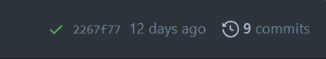

# Semantic HTML and basic navigation

Create HTML pages using semantic markup. Include a navigation menu that links to two subpages.

## Concepts covered

Semantic HTML, navigation, relative paths, `` and its attributes.

 :warning: This assignment builds on your _First web page_ assignment                                                                                                                                                                                                                                                                                                                                                                               |
| :-------------------------------------------------------------------------------------------------------------------------------------------------------------------------------------------------------------------------------------------------------------------------------------------------------------------------------------------------------------------------------------------------------------------------------------------------- |
| After cloning this repo and opening it in VSCode, copy the following files and folder from your _First web page_ assignment into this repo.  <ul><li>📄 index.html</li><li>📄 favicon.ico</li><li>📁images</li></ul> **Make sure that you don't copy any other folders or files, including the `test` and `readme-assets` folders, the hidden `.git` and `.github` folders, and the `package.json` files** |

## ⌨️ Update your  main `index.html` file

### Add block-level semantic elements inside `<body>`

| 💡 For review of semantic elements                                                                                                                                                                                                                                                                                                            |
| :------------------------------------------------------------------------------------------------------------------------------------------------------------------------------------------------------------------------------------------------------------------------------------------------------------------------------------------------ |
| <ul><li>See w3school's [HTML semantic elements](https://www.w3schools.com/html/html5_semantic_elements.asp) for a helpful summary and list of tags.</li><li>Read the individual element's pages on MDN in the list in their [Semantics in HTML](https://developer.mozilla.org/en-US/docs/Glossary/Semantics#semantics_in_html) section.</li></ul> |

After copying your `index.html` file from your _First web page_ assignment, open it in VS Code.

Below, I will give you a list of elements to add to your main page. Use your site topic to add content (text) inside the elements. The content is not as important as the structure of the page, so don't worry about spending a lot of time on writing "perfect" content.

| 💡 Using Emmet abbreviations                                                                                                                                                                                                                                                        |
| :-------------------------------------------------------------------------------------------------------------------------------------------------------------------------------------------------------------------------------------------------------------------------------------- |
| You can use Emmet abbreviations to quickly add HTML tags. Reference the [Emmet cheat sheet](https://docs.emmet.io/cheat-sheet/) for a list of abbreviations. See if you can come up with a one-line Emmet abbreviation that can generate all the tags listed in the requirements above. |

<table>
  <tr><th colspan="2">Emmet example</th></tr>
  <tr>
    <td>type <code>header>nav>ul>li*3>a</code> and press <code>TAB</code> to generate this HTML</td>
  <td><pre><code>&lt;header&gt;
    &lt;nav&gt;
      &lt;ul&gt;
        &lt;li&gt;&lt;a href=""&gt;&lt;/a&gt;&lt;/li&gt;
        &lt;li&gt;&lt;a href=""&gt;&lt;/a&gt;&lt;/li&gt;
        &lt;li&gt;&lt;a href=""&gt;&lt;/a&gt;&lt;/li&gt;
      &lt;/ul&gt;
    &lt;/nav&gt;
  &lt;/header&gt;</code></pre></td>
  </tr>
</table>

Add the following elements. The `<header>`, `<main>`, `<aside>` and `<footer>` elements should be _top level_ or direct children of `<body>`. In other words, don't nest them inside each other. Your `<h1>` and `
` can be top level also as we will eventually move the to a hero section:

- `<header>`
  - Inside `<header>` add a `<nav>`
    - Inside the `<nav>`, use a `<ul>` for the navigation menu and include "Home" "About" and "Contact" list items. We'll add links to these later in the assignment.
- `<main>`
  - Inside `<main>` add two `<article>` elements
    - Inside each `<article>` include a descriptive `<h2>` and at least one `
` element
- `<aside>` - you can include a pull quote from one of your articles or extra information to supplement your articles. Wrap text in `
` tags.
- `<footer>` - wrap text in `
` tags.

### 📷 `<figure>` element

Add a `<figure>` to your page inside an `<article>`.

You can use [Unsplash](https://unsplash.com/) to find images, but you must resize any image to 900px wide or less. [befunky](https://www.befunky.com/create/) is a free online site where you can easily crop and resize images.

|⚠️ Save your original images.|
|:---|
| We will need larger image sizes in later assignments. If you resize an image, save the original first. Place the original in an `originals` folder inside your `images` folder, or append `.original` (or something similar) to the file name. |

Your `<figure>` should include an `` and a `<figcaption>`.

The image must be

- placed in the `images` folder
- appropriately sized (900px wide or less)

The image element must

- include a _relative_ path to the image file in the `images` folder

  | :warning: Image and folder names                                                                                                                                                                                                                                                                                                                                                                                                   |
  | :--------------------------------------------------------------------------------------------------------------------------------------------------------------------------------------------------------------------------------------------------------------------------------------------------------------------------------------------------------------------------------------------------------------------------------- |
  | Never use spaces in an image or folder name that will be hosted on the web. Best practices are to always use lowercase letters and to use hyphens `-` (not underlines `_`) to separate words.   Since search engines look at image file names, give your image files descriptive names. For example, if you have a PNG image of a hedgehog, name the file `hedgehog.png` instead of something vague list `DCIMG-3033-54.png` |

- include an `alt` attribute

  | 💡 Writing `alt` text                                                                                                                                                                                                     |
  | :---------------------------------------------------------------------------------------------------------------------------------------------------------------------------------------------------------------------------- |
  | Read a11y collective's [How to write great alt text](https://www.a11y-collective.com/how-to-write-great-alt-text/) for tips on writing good alt text. Remember to never include "image of..." in alt text as it is redundant. |

- use both `height` and `width` attributes appropriately

  | 💡 The `` `height` and `width` attributes                                                                                                                                                                                      |
  | :------------------------------------------------------------------------------------------------------------------------------------------------------------------------------------------------------------------------------------------------------------------------------- |
  | The HTML size attributes must be set to an image's actual (intrinsic) dimensions and not used to size the image. Use CSS to resize images. For more info on why, reference Smashing Magazine's [Setting Height And Width On Images Is Important Again](https://www.smashingmagazine.com/2020/03/setting-height-width-images-important-again/) |

#### 🤯 Using Emmet to auto-generate the `height` and `width` attributes

VS Code has a command **Emmet: Update Image Size** that will automatically add the `height` and `width` attributes to an `` element so you don't have to look them up.

### :pencil: Text-level semantic elements

Somewhere on your main `index.html` page, include the following text-level semantic elements with content in each:

- `<strong>`
- `<em>`

## Configure your About and Contact subpages

Open both the `about/index.html` and `contact/index.html` files that were included in this repo. For each file,

- Set the title
- Add a meta description
- Copy the 4 lines of favicon info from the `<head>` of your main `index.html` and paste it in the `<head>` of both those files. Modify the path to the `images` folder to be relative to the `about` and `contact` folders.

Feel free to modify the your About and Contact pages to include more content. We will eventually add a form to the Contact page.

## Add links to the navigation menus

| :bulb: Relative links                                                                                                                                                                                                                                                                                                                                                |
| :------------------------------------------------------------------------------------------------------------------------------------------------------------------------------------------------------------------------------------------------------------------------------------------------------------------------------------------------------------------- |
| Review MDN's [A quick primer on URLs and paths](https://developer.mozilla.org/en-US/docs/Learn/HTML/Introduction_to_HTML/Creating_hyperlinks#a_quick_primer_on_urls_and_paths) for a review of relative links. Since the target files in the subfolders are named `index.html`, you don't need to include `index.html` in the paths. This generates a "cleaner" URL. |

- In your main `index.html` navigation menu, add relative links to the About and Contact pages. Don't add `index.html` to the paths; use only folder names and end the link with a `/` to indicate the last value is a folder.
- Do the same for the About and Contact pages.

Check that all your links work and you can easily navigate between the pages.

| 💡 Placeholder links                                                                                                                                                                                                                                                                                       |
| :------------------------------------------------------------------------------------------------------------------------------------------------------------------------------------------------------------------------------------------------------------------------------------------------------------- |
| You may notice on the About subpage that the `<a>` element for the About link is missing an `href` (the contact page is the same). An `href` attribute is not required, and you don't need to link a page to itself. The lack of an `href` attribute will make it easier to style the menu when we get to CSS. |

💻  Use Live Server to preview your webpage

Before you open your webpage in Live Server, make sure all your files are saved, then check the bottom left status bar on VS Code. You want to make sure you don't have any errors or warnings which should look like this:

If you have errors or warnings, click on the icons to see what they are and fix them, and re-save your files.

Once any problems are fixed, open your website in Live Server.

Make sure that you can see your favicons in the browser tab for all three of your web pages. If you don't seen them, try a _hard reload_ to see if that makes them appear. If a hard reload doesn't work, check your image paths and make sure that your files are in the right location.

If everything looks good then.....

## ⬆️ Use VS Code's Source Control to commit your changes and sync these changes to Github

- Open the Source Control menu
- Enter a commit message
- Click `✓ Commit` to commit your changes.
- Click `↻ Sync Changes ↑` to sync your changes to Github.

### 🚀 Publish your web page on Github Pages

Open your repo on Github. Publish your site on GitHub pages.

### Enter your repo about information

In your main repo page edit the About section. Enter a description of your repo and add your Pages URL in the **Website** text field.

## Validate your HTML with validator.nu

| 💡 Why validate? |
|:-----|
| Remember to validate all your web pages before checking the automated tests. It's easier to find validator errors on `validator.nu` than in the GitHub validator action output. |

Once your page is live, use the [validator.nu](https://validator.nu/) service to validate the HTML on all three of your web pages (main, contact, about). Select Show "outline" and "image report" then paste your page URL into the validator and click `Check`.

Check that your image has a valid `alt` attribute.

If you have any errors, fix them in VSCode, commit and sync, and then re-validate your page. Make sure to wait a few minutes for Github to generate the updated page.

## Pass automated tests

After you've ensured that your page has validated, open your repo in Github and check that you've passed the automated tests. Look at the top right of your repo header. If you have passed all the tests, you'll see a green check mark:

If you failed any tests, you will see a red X. Click on the X to see which test failed. Click on the failed test name for more details.

If you see a yellow dot, it means that the test is still running. Wait for the test to finish.

### Current automated tests

- General HTML structure
  - REQUIRED FOR ALL PAGES
    - Conventions
      - main index.html has `<title>`, `<meta>` description and favicon info
      - about index.html has `<title>`, `<meta>` description and favicon info
      - contact index.html has `<title>`, `<meta>` description and favicon info
      - main index.html contains exactly one `<h1>`
      - about index.html contains exactly one `<h1>`
      - contact index.html contains exactly one `<h1>`
      - single tags end with '>' not '/>' (e.g. `<meta ... >` not `<meta ... />`)
    - Main menu
      - main index.html has a `<header>` containing a `<nav>` and a `<ul>`
      - about index.html has a `<header>` containing a `<nav>` and a `<ul>`
      - contact index.html has a `<header>` containing a `<nav>` and a `<ul>`
      - main index.html - relative paths used in main menu; paths do not end with 'index.html'
      - about index.html - relative paths used in main menu; paths do not end with 'index.html'
      - contact index.html - relative paths used in main menu; paths do not end with 'index.html'
  - MAIN index.html ONLY
    - contains `<figure>` with one image and a `<figcaption>`
    - contains a `<main>`
    - `<main>` contains at least two `<article>` elements
    - `<article>` elements contain an `<h2>` and at least one `
`
    - contains an `<aside>` with text inside a `
`
    - contains a `<footer>` with text inside a `
`
    - uses at least one instance of `<strong>`
    - uses at least one instance of `<em>`

- Image tests
  - image paths are all lowercase and contain no spaces
  - images must be 900px wide or less
  - relative paths to images used, and images must be in the images directory
  - `` height and width attributes set to the image's intrinsic dimensions

## Submit your repo URL to Learning Suite

When you are ready to have your assignment graded, submit your repo (not web page) URL to Learning Suite in the assignment comments.
